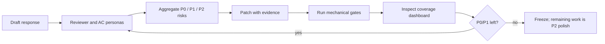
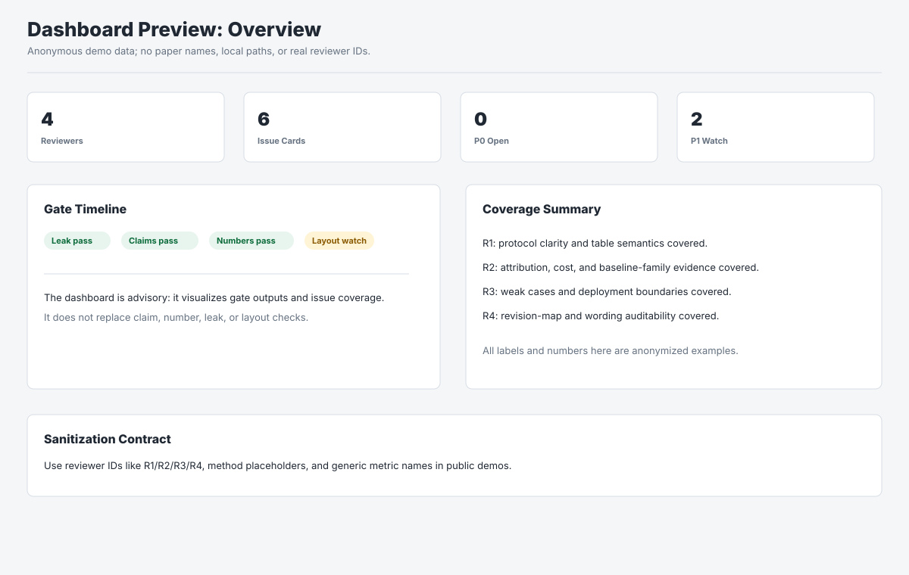
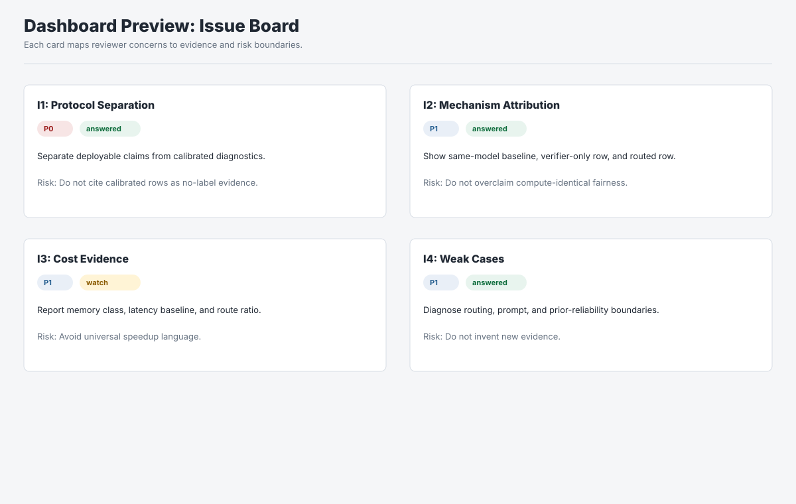
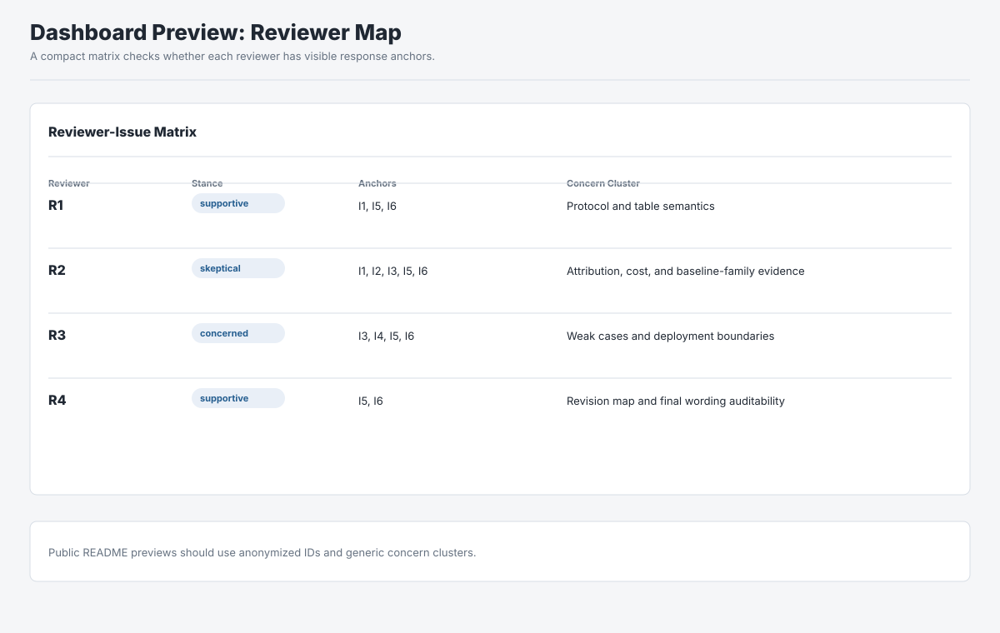

<p align="center">
  
</p>

<h1 align="center">Rebuttal Skill Suite</h1>

<p align="center">
  A Codex skill suite for turning high-stakes academic rebuttals into an evidence-backed review loop.
</p>

<p align="center">
  <a href="./VERSION"></a>
  <a href="./LICENSE"></a>
  
  
</p>

<p align="center">
  <a href="#install-locally">Install</a> |
  <a href="#run-mechanical-gates">Run gates</a> |
  <a href="#anonymized-dashboard-preview">Dashboard</a> |
  <a href="#reviewer-persona-loop">Reviewer loop</a> |
  <a href="#release-validation">Release validation</a> |
  <a href="./CHANGELOG.md">Changelog</a>
</p>

## Why It Exists

Author responses fail when they sound polished but still leak private process, contradict the paper, miss reviewer-specific evidence, overclaim results, or promise revisions that cannot be audited. Rebuttal Skill Suite packages those failure modes into reusable Codex skills, reviewer personas, schema checks, regression fixtures, dashboard previews, and release hygiene scripts.

The suite is built around one rule: every rebuttal patch should be the smallest change backed by evidence, and every public-facing claim should survive independent mechanical checks.



## What Is Included

| Area | Paths | Purpose |
| --- | --- | --- |
| Codex skills | `skills/rebuttal-audit/`, `skills/rebuttal-leak-audit/` | One-page rebuttal audit and public-leak audit workflows. |
| Reviewer roles | `reviewer_roles/` | Independent reviewer, AC, layout, artifact-consistency, protocol/cost, and fairness passes. |
| End-to-end workflow | `workflows/adversarial_rebuttal_loop.md` | The closed-loop iteration protocol. |
| Dashboard preview | `webview/`, `docs/images/`, `scripts/start_dashboard.sh`, `scripts/render_dashboard_views.py` | Anonymous local issue-coverage board plus README-safe SVG previews. |
| Upgrade prompt | `prompts/upgrade_skill_suite.md` | Paste-ready prompt for extending the suite from real rebuttal lessons. |
| Mechanical gates | `scripts/run_rebuttal_gates.sh`, `scripts/validate_suite.sh` | Compile, leak, layout, content, schema, dashboard, and regression validation wrappers. |
| Optional ledgers | `schemas/*.example.csv` | Claim, number, result-table, and reviewer-issue map schemas. |
| Regression fixtures | `examples/` | Anonymous good examples and intentionally bad fixtures used by validation scripts. |
| Release tooling | `scripts/build_release_archive.sh`, `scripts/validate_release_package.py`, `scripts/validate_repo_clean.py` | Build and verify a clean distributable archive. |

## Anonymized Dashboard Preview

The suite includes a lightweight static webview for visual inspection of issue coverage, reviewer anchors, and gate status. The bundled data and README images are deliberately anonymized: reviewer IDs are `R1/R2/R3/R4`, methods are generic, and no paper names, local paths, real reviewer identifiers, or project-specific numbers are included.







Run the local demo:

```bash
bash scripts/start_dashboard.sh
```

Then open `http://127.0.0.1:7864/`. Treat this dashboard as an internal control surface; reviewer-facing content should still go through the leak, claim, number, tone, cost, revision-map, response-text, and layout gates.

## Install Locally

Requirements:

- Bash
- Python 3
- Codex skills directory, usually `~/.codex/skills`
- Optional TeX/PDF tooling when checking rendered one-page rebuttal PDFs

Copy the skills into your Codex skills directory:

```bash
bash scripts/install_skills.sh
```

Check installed copies match this repository:

```bash
bash scripts/install_skills.sh --check
```

Install under a custom Codex home:

```bash
bash scripts/install_skills.sh --codex-home /path/to/.codex
```

## Run Mechanical Gates

Run the main rebuttal gate against a rendered response source:

```bash
bash scripts/run_rebuttal_gates.sh \
  /path/to/rebuttal.tex \
  R1,R2,R3,R4
```

The gate compiles the TeX, fails on high-severity public-facing leaks, checks reviewer coverage, page count, LaTeX warnings, short visual tail lines, protocol/cost consistency signals, and one-page fullness.

Add project-specific evidence ledgers without hardcoding paper facts into the suite:

```bash
REBUTTAL_CLAIM_LEDGER=/path/to/claim_ledger.csv \
REBUTTAL_CLAIM_WINDOW=520 \
REBUTTAL_NUMBER_LEDGER=/path/to/reported_numbers.csv \
REBUTTAL_RESULT_TABLE=/path/to/result_summary.csv \
REBUTTAL_RESULT_EXPECTATIONS=/path/to/result_table_expectations.csv \
REBUTTAL_ISSUE_MAP=/path/to/reviewer_issue_map.csv \
  bash scripts/run_rebuttal_gates.sh /path/to/rebuttal.tex R1,R2,R3,R4
```

The claim, number, and tone checkers preserve escaped LaTeX percentages such as `68.85\%`, so evidence or protocol wording after a percentage on the same source line remains auditable.

Check a final text-box submission, such as OpenReview or CMT:

```bash
REBUTTAL_RESPONSE_TEXT=/path/to/final_response.md \
REBUTTAL_RESPONSE_MAX_WORDS=750 \
REBUTTAL_RESPONSE_PLATFORM=openreview \
  bash scripts/run_rebuttal_gates.sh /path/to/rebuttal.tex R1,R2,R3,R4
```

## Focused Checkers

| Checker | Example command | Catches |
| --- | --- | --- |
| Claim ledger | `python3 scripts/check_claim_ledger.py examples/anonymous_rebuttal.tex --ledger schemas/claim_ledger.example.csv` | Evidence/scope/label-use drift. |
| Reported numbers | `python3 scripts/check_reported_numbers.py examples/anonymous_rebuttal.tex --numbers schemas/reported_numbers.example.csv` | Result-number mismatch. |
| Result tables | `python3 scripts/check_result_table.py examples/result_summary.csv --expect schemas/result_table_expectations.example.csv` | Structured CSV/TSV expectation drift. |
| Reviewer issue map | `python3 scripts/check_reviewer_issue_map.py examples/issue_map_response_good.md --map schemas/reviewer_issue_map.example.csv --reviewers R1,R2,R3,R4 --fail-on P1` | Missing reviewer concern coverage. |
| Tone | `python3 scripts/check_rebuttal_tone.py examples/tone_good.md --fail-on P1` | Defensive, overclaiming, casual, or strategy-like wording. |
| Cost evidence | `python3 scripts/check_cost_evidence.py examples/cost_evidence_good.md --fail-on P1` | Cost answers without memory, latency baseline, route ratio, or relevant baseline families. |
| Revision map | `python3 scripts/check_revision_map.py examples/revision_map_good.tex --fail-on P1 --require-map` | Role, label-use, fixed-pair, and calibrated/tuned inconsistencies. |
| Layout readiness | `python3 scripts/check_layout_readiness.py examples/layout_metrics_good.txt --fail-on P2` | Lower-page blanks, column imbalance, and low extracted word density. |
| Response text | `python3 scripts/check_response_text.py examples/platform_response_good.md --reviewers R1,R2,R3,R4 --require-reviewers --platform openreview --max-words 220 --max-chars 1500` | Missing reviewer IDs, placeholders, local paths, and platform-unsafe LaTeX commands. |
| Revision promises | `python3 scripts/check_revision_promises.py examples/revision_promises_good.md --fail-on P1` | Broad promises without a concrete revised-paper location or evidence hook. |
| Visual density | `python3 scripts/check_pdf_visual_density.py rebuttal.pdf --fail-on P1` | Screenshot-style dense bands in compact rendered PDFs. |
| Dashboard views | `python3 scripts/render_dashboard_views.py` | Stale or missing README dashboard previews. |

Draft a reviewer-issue map before hand-editing the CSV gate input:

```bash
python3 scripts/generate_reviewer_issue_map.py reviews.md \
  --response rebuttal.tex \
  --reviewers R1,R2,R3 \
  --output reviewer_issue_map.draft.csv
```

Select conservative response-box budgets:

```bash
python3 scripts/response_budget_presets.py --list
python3 scripts/response_budget_presets.py openreview-750w --args
python3 scripts/response_budget_presets.py openreview-750w --shell
```

## Reviewer Persona Loop

Use the role prompts as independent passes over the rendered PDF and source TeX:

```text
Use reviewer_roles/protocol_cost_reviewer.md to review rebuttal.pdf and rebuttal.tex.
Find P0/P1/P2 issues first, then propose minimal fixes.
```

Recommended order:

1. `reviewer_roles/protocol_cost_reviewer.md`
2. `reviewer_roles/evidence_artifact_consistency.md`
3. `reviewer_roles/deployment_fairness_reviewer.md`
4. `reviewer_roles/threshold_attribution_reviewer.md`
5. `reviewer_roles/layout_submission_auditor.md`
6. `reviewer_roles/supportive_clarity_reviewer.md`
7. `reviewer_roles/AC_synthesizer.md`

After collecting persona outputs:

```bash
python3 scripts/aggregate_reviewer_feedback.py feedback_dir/
python3 scripts/check_persona_outputs.py feedback_dir/
```

## Severity Standard

| Severity | Meaning |
| --- | --- |
| `P0` | Factual contradiction, protocol ambiguity, label-use confusion, private leakage, evidence mismatch, or anything that can make the AC distrust the response. |
| `P1` | Missing reviewer-specific evidence, cost/fairness/negative-case gap, unclear attribution, overclaiming, vague limitation promise, or a table/prose mismatch that weakens the rebuttal. |
| `P2` | Density, wording, table polish, optional title/spacing, harmless warnings, or taste-level suggestions. |

## Upgrade Patterns Encoded

The current suite version encodes the main failure modes found across iterative rebuttal passes:

- Separate strict results, diagnostics, calibrated analyses, deployable claims, sensitivity analysis, and negative-case diagnosis.
- Require thresholds, fixed-pair claims, full-set/subset statements, and label-use modes to state scope.
- Map important numbers, tables, reviewer concerns, cost claims, latency baselines, route ratios, revision promises, and limitation promises to auditable artifacts.
- Detect local paths, logs, tool traces, private experiment logistics, teacher/advisor/AI/persona feedback leakage, and tactical reviewer wording.
- Inspect rendered PDF layout, lower-column blanks, column-bottom balance, response-box safety, screenshot-style visual density, and dashboard coverage.
- Stop once P0 issues are resolved, P1 issues have evidence or explicit bounds, and remaining comments are P2 polish.

See [CHANGELOG.md](./CHANGELOG.md) for the version-by-version implementation history.

## Release Validation

Run the standard validation wrapper:

```bash
bash scripts/validate_suite.sh
```

Regenerate README dashboard views when dashboard data or visual framing changes:

```bash
python3 scripts/render_dashboard_views.py
```

Run package and repository hygiene checks:

```bash
python3 scripts/validate_release_package.py .
python3 scripts/validate_repo_clean.py .
```

Build and validate a distributable archive:

```bash
RELEASE_OUT_DIR=/tmp/rebuttal-release bash scripts/build_release_archive.sh
```

The release archive is named `rebuttal-skill-suite-<VERSION>.tar.gz` under `RELEASE_OUT_DIR`. The build script extracts the archive and reruns release package validation, repo hygiene validation, skill validation, regression fixtures, and suite validation before printing `RELEASE_ARCHIVE_OK`.

For the full preflight list, use [RELEASE_CHECKLIST.md](./RELEASE_CHECKLIST.md).

## Stop Rule

Stop editing a rebuttal when:

- P0 issues are resolved.
- P1 issues have concrete evidence, explicit bounds, or a deliberate non-fix rationale.
- No internal/developer notes leak.
- The PDF is one page and has no obvious layout defects.
- Remaining comments are P2 taste, harmless warnings, or subjective preference.

## License

MIT. See [LICENSE](./LICENSE).
